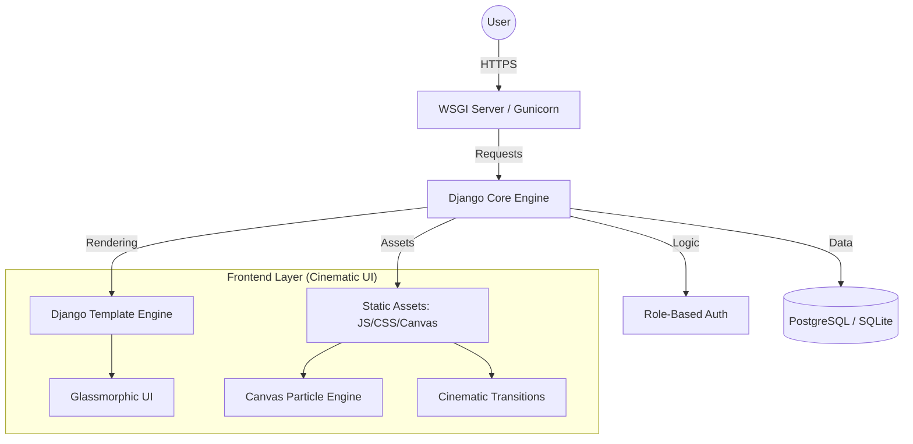

# 🎓 AlumniConnect®
> **A premium, cinematic mentorship and networking platform bridging the gap between ambitious students and experienced alumni.**

[](https://www.python.org/)
[](https://www.djangoproject.com/)
[](LICENSE)

AlumniConnect® is a high-fidelity, production-grade web application designed for educational institutions. It facilitates meaningful mentorships, secure networking, and professional growth through a stunning, cinematic user experience.

---

## ✨ Premium Features & Cinematic UI

### 🎞️ Cinematic Entrance & Visuals
*   **Logo-Fill Preloader**: A professional, session-aware cinematic entrance animation that prevents "hurried" page loads.
*   **CanvasFire Background**: A real-time particle engine rendering dynamic sparks, embers, and glow that blends seamlessly with the institutional campus background.
*   **Glassmorphic Design System**: A custom CSS framework utilizing deep blur effects, glowing borders, and tactile micro-interactions.

### 🔐 Modern Authentication
*   **Role-Specific Portals**: Dedicated, sequenced entrance animations for Student, Alumni, and Admin logins.
*   **Advanced Security**: Password visibility toggles, session-based memory, and secure role separation.

### 🤝 Mentorship & Networking
*   **1:1 Mentorship System**: Verified students can request mentorship from experienced alumni.
*   **Secure Messaging**: Direct, real-time communication channel unlocked upon mentorship approval.
*   **Opportunity Hub**: Centralized board for alumni to post job openings, internships, and events.

---

## 🏗️ Project Architecture

AlumniConnect is built on a robust, decoupled architecture designed for scalability, performance, and institutional security.

### 📡 System Overview


### 🗄️ Database Schema & Relationships
The platform utilizes a relational database structure with a **Custom User Model** at its core to support multi-role authentication.

*   **User Model**: Core identity with `is_student`, `is_alumni`, and `is_admin` flags.
*   **Profiles**: One-to-One relationships extending the User model with role-specific metadata (Bio, Skills, Graduation Year).
*   **Mentorship Requests**: Handles the state management (Pending/Accepted/Rejected) between Students and Alumni.
*   **Messaging Engine**: Secure storage of 1:1 communications, filtered by approved mentorship status.
*   **Opportunity Board**: Multi-type posting system (Jobs/Internships/Events) with alumni authorship.

### 🛡️ Role-Based Access Control (RBAC)
Authentication and Authorization are enforced at the view level using Django decorators and mixins:
-   **Student Access**: Restricted to browsing alumni and managing their own mentorship requests.
-   **Alumni Access**: Authorized to manage mentee pools, post to the Opportunity Board, and access analytics.
-   **Admin Access**: Full platform oversight including user verification and site-wide monitoring via the Jazzmin-enhanced control center.

### 🎨 Frontend Pipeline
-   **Design System**: Custom CSS variables for theme tokens (Noir aesthetic).
-   **Rendering**: Server-Side Rendering (SSR) for SEO and initial load speed, augmented by AJAX for seamless profile views.
-   **Animations**: Hardware-accelerated CSS3 transforms and `requestAnimationFrame` for the Canvas particle engine.

---

## 🛠 Tech Stack

| Category | Technology |
| :--- | :--- |
| **Backend** | Django 6.0 (Python 3.12+) |
| **Styling** | Vanilla CSS3 (Custom Design System), Bootstrap 5 |
| **Interactions** | Vanilla JavaScript (ES6+), Canvas API (Particles) |
| **Database** | SQLite (Dev) / PostgreSQL (Prod) |
| **Typography** | Instrument Serif, Inter, Instrument Sans |

---

## 🚀 Getting Started

### Prerequisites
- Python 3.12 or higher
- pip (Python package installer)

### Installation

**1. Clone and Navigate**
```bash
git clone https://github.com/yourusername/AlumniConnect.git
cd AlumniConnect
```

**2. Virtual Environment & Dependencies**
```bash
python -m venv venv
# Windows:
venv\Scripts\activate
# Unix:
source venv/bin/activate

pip install django pillow
```

**3. Database Initialization**
```bash
cd alumniconnect
python manage.py migrate
python seed_data.py                         # Generates mock students, alumni, and jobs
```

**4. Start the Engine**
```bash
python manage.py runserver
```
Visit `http://127.0.0.1:8000` to experience the cinematic entrance.

---

## 📁 Directory Structure

```text
alumniconnect/
├── alumniconnect/          # Core Configuration (settings, urls, wsgi)
├── mainapp/                # Business Logic & Models
│   ├── models.py           # Database Schemas (User, Profiles, Messages)
│   ├── views.py            # Route Handlers & RBAC Logic
│   ├── forms.py            # Validated Input Handlers
│   └── urls.py             # App-level Routing
├── static/                 # Frontend Assets
│   ├── css/main.css        # Glassmorphic Design System
│   └── js/main.js          # Canvas Fire Engine & Logic
├── templates/              # Cinematic UI Layouts
└── media/                  # User-uploaded Content
```

---

## 📜 License
Distributed under the MIT License. Built with ❤️ for educational excellence and professional connection.

---
*AlumniConnect® — Where Futures Connect*